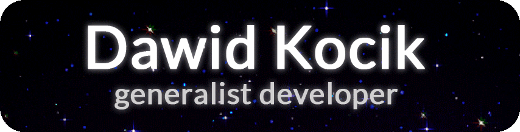

<!-- intro image - dm me on discord if you want an image like this -->

<!-- wakatime stats -->

 

### :heart: I love

### :broken_heart: I hate

### :speech_balloon: Reach me

### :musical_note: I'm currently listening to

<!-- resources used:
https://shields.io/
https://github.com/novatorem/novatorem
https://simpleicons.org/
https://github.com/anuraghazra/github-readme-stats
for special characters in shields.io names: https://cachefly.zendesk.com/hc/en-us/articles/215068626-How-to-format-URLs-that-have-special-characters-in-the-filename
custom shields.io icon: https://stackoverflow.com/a/41472017
happy readme making! -->
